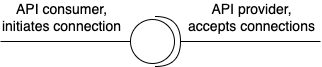

# Architecture of Erigon

Erigon is different from many other implementations of Ethereum (or other blockchain protocols) is that it is less monolithic and more modular. But the word "modular" here needs to be understood quite specifically. Modules are not just code packages that end up complied into a single executable. In Erigon, modules (or we more often call them "components") are parts of Erigon that can be taken out into a separate executable, and then operated in its own process (of the operating system), or even on its own computer in the network. Below is the illustration of how Erigon currently splits up into components (modules):

Components are shown as rectangles. In the current version of Erigon code, all components shown as rectangles are “separable”, meaning that they can be run as separate processes. Where two overlapping rectangles are shown, it means that more than one component of this type can be run at the same time, and on multiple computers. All components are separable, and all of them can currently run within the same process (embeddable). However, downloader/seeder components need need to be run on the same computer even if they are separated, to be able to share downloaded and seeded files with Erigon.

The “lollipop” notation is explained below:

